# Gophers....

The Go gopher was designed by the awesome [Renee French](http://reneefrench.blogspot.com/). Read http://blog.golang.org/gopher for more details.

The images and art-work in this repository are under [CC0 license](https://creativecommons.org/publicdomain/zero/1.0/).

However, if you do use something, you are encouraged to:

* tweet about the used, remixed or printed result @egonelbre
* submit new ideas via twitter @egonelbre
* request some sketch to be vectorized

Or if you like to directly support me:

<a target="_blank" href="https://www.buymeacoffee.com/egon">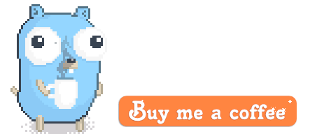</a>

 

# Vector

Here are svg images that can be modified for your own needs.

[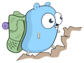](vector/adventure/hiking.svg)
[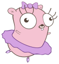](vector/arts/ballet.svg)
[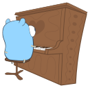](vector/arts/upright.svg)

[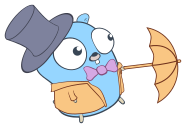](vector/dandy/umbrella.svg)

[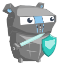](vector/fairy-tale/knight.svg)
[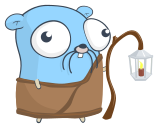](vector/fairy-tale/sage.svg)
[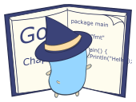](vector/fairy-tale/witch-learning.svg)

[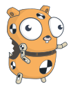](vector/friends/crash-dummy.svg)
[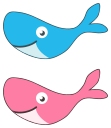](vector/friends/docker.svg)

[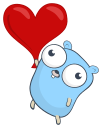](vector/friends/heart-balloon.svg)
[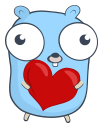](vector/friends/heart-hug.svg)
[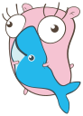](vector/friends/hugging-docker.svg)

[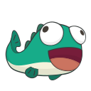](vector/friends/monkfish.svg)

[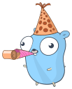](vector/party/birthday.svg)
[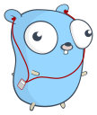](vector/party/music.svg)

[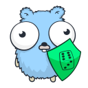](vector/projects/go-fuzz.svg)

[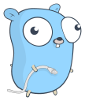](vector/projects/network-side.svg)
[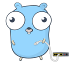](vector/projects/network.svg)
[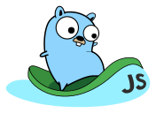](vector/projects/surfing-js.svg)
[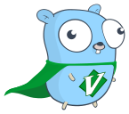](vector/projects/vim-go.svg)
[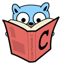](vector/projects/with-C-book.svg)
[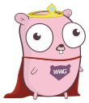](vector/projects/wwgl.svg)
[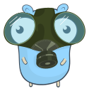](vector/science/gas-mask.svg)
[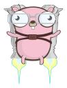](vector/science/jet-pack.svg)
[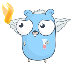](vector/science/mistake.svg)
[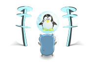](vector/science/power-to-the-linux.svg)
[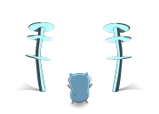](vector/science/power-to-the-mac.svg)
[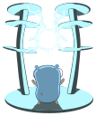](vector/science/power-to-the-masses.svg)
[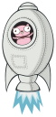](vector/science/rocket.svg)
[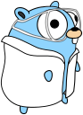](vector/science/scientist.svg)
[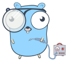](vector/science/soldering.svg)
[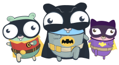](vector/superhero/gotham.svg)
[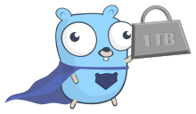](vector/superhero/lifting-1TB.svg)

[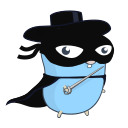](vector/superhero/zorro.svg)

# Sketches

Here are several hand-drawn images. Let me know if you would like to
see a particular one be vectorized.

[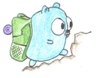](sketch/adventure/hiking.png)
[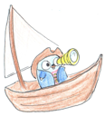](sketch/adventure/pirate-boat.png)
[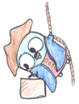](sketch/adventure/pirate-lifting-goods.png)

[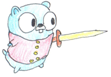](sketch/adventure/pirate-sword.png)
[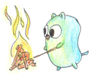](sketch/adventure/poking-fire.png)
[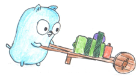](sketch/adventure/pushing-cart.png)
[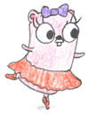](sketch/arts/ballet-v2.png)
[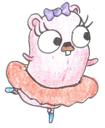](sketch/arts/ballet.png)
[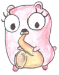](sketch/arts/saxophone.png)
[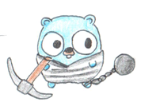](sketch/convict/chained.png)
[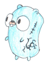](sketch/convict/hard-times.png)
[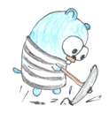](sketch/convict/working-hard.png)
[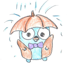](sketch/dandy/raining.png)
[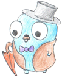](sketch/dandy/standing.png)
[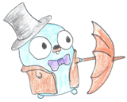](sketch/dandy/umbrella.png)

